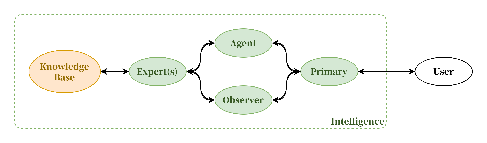
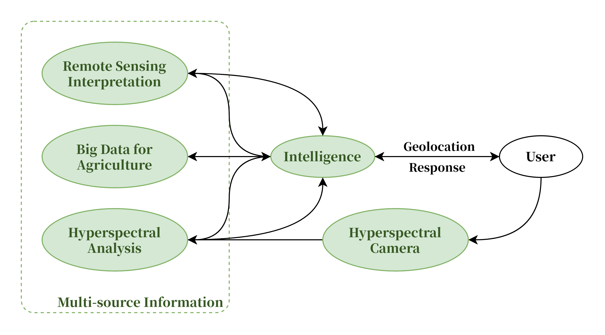
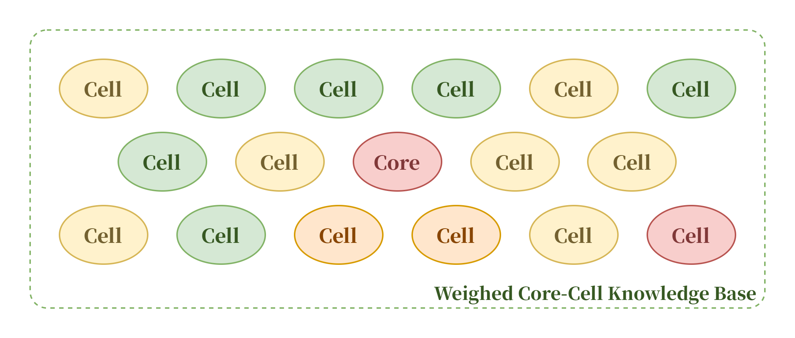
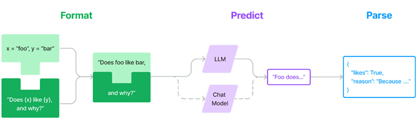
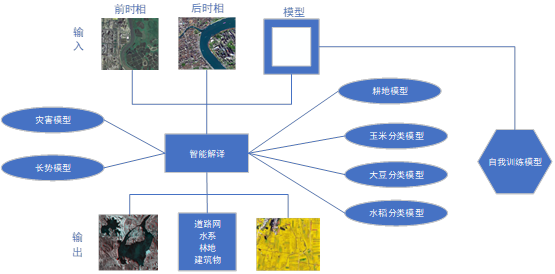
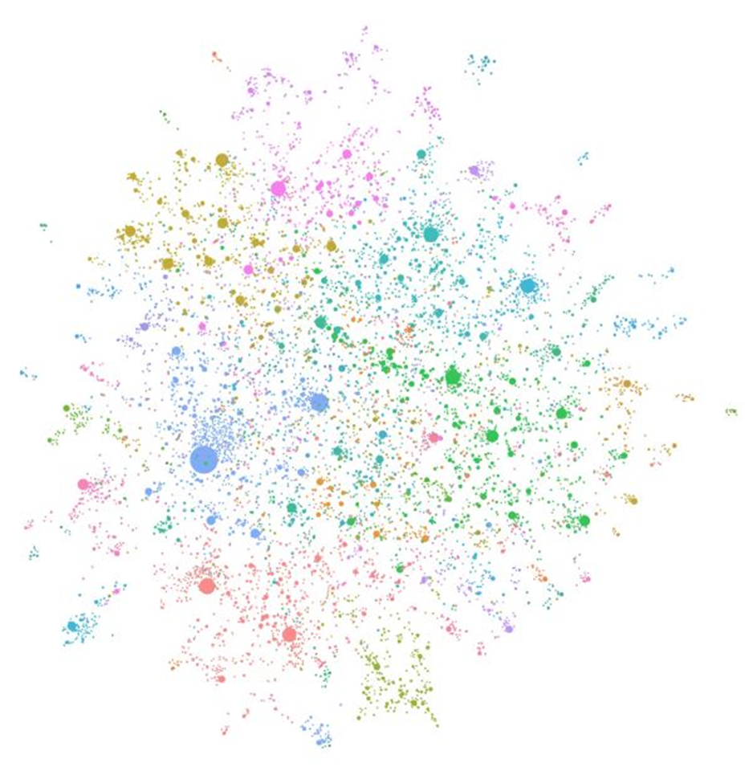
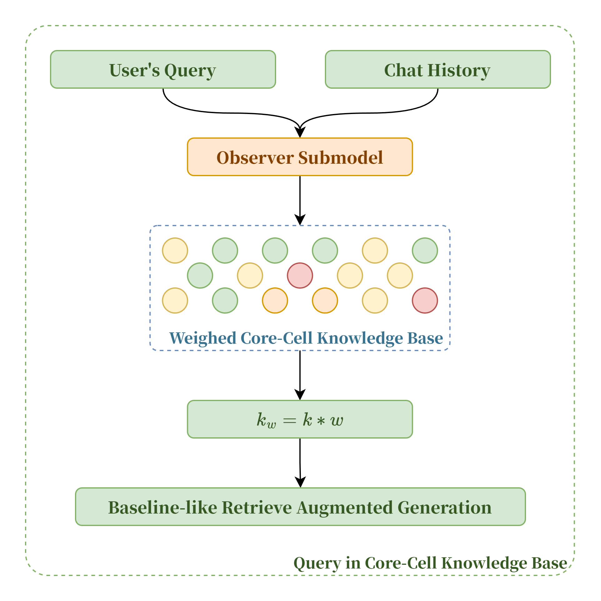
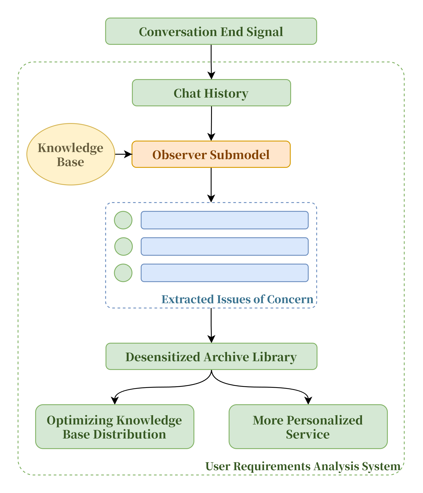

---
# https://vitepress.dev/reference/default-theme-home-page
layout: home

hero:
  name: "Saturn AI"
  text: "类 MoE 混合专家架构的多源细胞知识库农业智能体"
  tagline: 以人为本的产前、产中、产后全生命周期智能农业服务
  actions:
    - theme: brand
      text: 快速了解
      link: "#图片展示"
    - theme: alt
      text: 在 GitHub 上查看
      link: https://github.com/jiwangyihao/Saturn-docs
  image:
    src: /logo.png
    alt: Saturn AI Logo

features:
  - title: 📌以人为本
    details: 以农户为中心，提供全生命周期智能农业服务
  - title: 🌏跨平台服务
    details: Web、App、小程序、智能硬件等多种平台服务
  - title: 🏡多源赋权
    details: 多源细胞知识库领域赋权，跨领域知识融合
---

## 图片展示

<el-carousel type="card" height="24vw" indicator-position="none">
  <el-carousel-item v-for="item, k in previewSrcList" :key="item">
    <el-image preview-teleported :preview-src-list="previewSrcList" :src="item" :initial-index="k" />
  </el-carousel-item>
</el-carousel>

## 产品描述

### 类 MoE 混合专家架构

MoE（Mix of Experts）， 应用前提把各个领域的专家集合起来一起攻克一个包括了多个领域知识的复杂问题。MoE模型由多个专业化的子模型即“专家”组合而成，每一个“专家”都在其擅长的领域内做出贡献。我们借鉴了MoE混合专家架构的思路，为不同能力的子模型指派角色，分工合作，对外表现为更强能力的智能体。

### 多源信息处理

团队拥有智能遥感解译系统、智慧农业大数据基座系统、多光谱相机数据分析系统等为智能体提供加工后的可靠数据，上述内容拥有自主知识产权，可以充分保障数据的可靠性以及安全性。

遥感影像智能解译系统，主要面向对象是农业智能的遥感图像处理，通过自研的耕地模型、分类模型、长势模型，能够高效、快捷提升数据生产任务。

智慧农业大数据基座系统，主要实现作物长势分析，面积估算，作物分类（大豆、玉米、水稻）、作物产量估算、黑土地保护、病虫害监控预警，地块历年轮作信息、收割进度、泡田进度监测、收割进度监测、四情信息等。

团队目前自研高光谱相机，通过自主算法将高光谱相机所得图像进行分析，处理成提供给AI的可靠数据。

基于智能遥感解译系统、智慧农业大数据基座系统、高光谱相机数据分析系统，智能体可获取高精度的实时实地数据参与分析，大大提高了智能体的实用性及可靠性，为智能体提供了更多信息来源。

### 核心--细胞知识库

在“核心-细胞知识库”体系中，我们为给大模型的知识供给增加了相应的权重设置。核心知识库总是会以高优先级提供，而细分领域的细胞知识库则会被划分权重。在每轮对话的RAG检索开始前，由Observer子模型分析对话中用户的问题与不同领域的相关度并产生权重得分，子模型产生的得分会在规范化后与k值叠加，这样也可以有效解决因术语相似导致的模型对不同领域知识的混淆与误解，减少“幻觉”现象的发生。

## 技术路线

### 类MoE的子模型协作系统

受到近来涌现的MoE架构大模型的启发，我们基于LangChain中“链”的概念把多个不同的模型工作流串联起来，使得不同特点的模型可以基于其各自的角色发挥不同的效果，组成子模型协作系统，对外表现出1+1+1>3的智能体能力，有效弥补了小尺寸大语言模型的能力缺陷。

同时高度抽象的架构设计使得我们可以在不同的基底模型上快速迁移，便于验证不同模型能力差异以及后续进一步的迭代开发。

### 智能遥感解译系统

遥感影像智能解译系统”是一个“面向对象+深度学习”的遥感图像处系统，“面向对象+深度学习”方法就是针对高分辨率影像而兴起的一种较先进的遥感影像分析方法,已经在国土、城市调查、水利、测绘、军事、林业、海洋、环境等研究领域有了较好的应用。架构图如下：

系统内置非常强大的基础能力集，通过这些能力构建的遥感解译算法，已经并在多个行业开展应用。其中包含20余个遥感解译基础算法（神经网络）、100余套遥感解译算法生产方案、 20余种遥感影像处理技术、10余种解译成果增强技术。支持水平扩展的高性能空间数据及样本管理仓库。

系统内置的数据仓库，能够管理无限多的遥感影像数据、结构化地理信息矢量数据、以及用这些数据生成的深度学习算法样本数据。除此之外，系统还提供智能样本生成能力，能够通过分析业务数据的统计特征，给出样本生成方案，并能够使用样本生成方案自动生成样本，生成的样本还可以进行精细化的管理。

### 智慧农业大数据基座系统

智慧农业大数据基座系统主要实现作物长势分析，面积估算，作物分类（大豆、玉米、水稻）、作物产量估算、黑土地保护、病虫害监控预警，地块历年轮作信息、收割进度、泡田进度监测、收割进度监测、四情信息等。

在空间维度上数据形成一个天空地人网，概括为智能遥感解译系统所得到的天空维度上的数据；低空无人机所得数据；地面上如高光谱相机作为机器视觉领域内数据以及地面相关传感器数据；网络上以及现实中人类经验知识库。

### 细胞-核心知识库

“数据从哪里来？”——这是所有大模型应用都会面临的问题。除此以外，如何保证数据的质量以及如何提高大模型的应用能力同样是目前亟待解决的难题。

对此，我们创造性地提出了“核心-细胞知识库”的方案。

基于高质量的、领域专家校对后的语料，我们建立了核心知识库。我们进行了大量的筛选和校对，以确保核心知识库的准确性和可靠性，让大模型智能体的回答“有深度”。

同时，基于最新的GraphRAG技术，我们将知识图谱技术与传统RAG结合起来，使用大模型从繁杂的专业领域资料中抽离出实体Entity和关联Relationship，随后使用Leiden技术对其分层聚类，最后自下而上地完成对整体Community及其成员地总结归纳。基于知识图谱的GraphRAG能够比传统的BaselineRAG表现出更佳的知识理解能力以及对整体知识结构的更好把握。这使我们能够低成本地快速建立细分领域知识库，让大模型智能体的回答“有广度”。

人工筛选校对的高质量知识库和基于GraphRAG地细分领域细胞知识库共同组成了我们的“核心-细胞知识库”。基于此架构，我们建立了一套可供大模型应用的深度与广度兼备的知识体系，保证了数据的量与质。

在提高大模型的知识应用能力上我们也进行了相应的优化。

在传统的RAG检索增强生成技术中，模型通常面对的是一个单一知识库。不同领域的知识被不加分类地存放在同一个向量数据库中，依靠文本向量嵌入技术进行简单地文本相似度匹配（即RAG中的k值），依据相似度高低来决定提供给模型的附加知识。

在我们的“核心-细胞知识库”体系中，我们为给大模型的知识供给增加了相应的权重设置。核心知识库总是会以高优先级提供，而细分领域的细胞知识库则会被划分权重。在每轮对话的RAG检索开始前，由Observer子模型分析对话中用户的问题与不同领域的相关度并产生权重得分，子模型产生的得分会在规范化后与k值叠加，这样也可以有效解决因术语相似导致的模型对不同领域知识的混淆与误解，减少“幻觉”现象的发生。

### 用户需求分析系统

在每轮对话结束之后，完整的对话历史会交由Observer子模型进行进一步分析，从中提炼出用户主要关心的问题并据此分析模型的回答质量。

这部分数据会在脱敏后存档，这使得我们可以根据用户的真实需求进一步优化知识库分布，提高模型回答质量，同时我们也可以根据用户需求提供更加个性化的服务。

### 基于 Nest.js 实现的服务端接口层

在本系统中，子模型协作系统的能力通过服务端接口层暴露给用户端，表现为一个统一的智能体系统。此外，服务端接口层还在一定程度上承担不同模型之间的通信工作，实现了与智能遥感解译系统、智慧农业大数据基座系统及高光谱数据分析系统的高效集成，还通过引入第三方API丰富了智能体的信息获取能力。

具体来说，服务端接口层基于Nest.js框架开发，向用户端提供了一套RESTful API。具体来说，服务端接口层以模块Module、控制器Controller、服务Service的形式组织。当服务端收到用户端请求时，由主模块Application Module的Controller将请求派发至各个子模块Sub Module，在各个子模块的控制器Controller中完成对请求数据的预处理以及对回传数据的包装，控制器Controller会调用对应服务Service中的业务代码来完成请求。

### 基于 Quasar Framework 的跨平台用户端

基于Vue3和Quasar Framework，我们得以与Electron.js、Capacitor等框架高效集成，可以实现多平台的快速部署。

我们使用Microsoft Speech Service实现用户端的语音识别/语音合成能力，识别准确，合成自然。

除了常规的面向一般用户的对话交互，我们还设计了一套用于数据管理的后台界面，这大大提高了数据生产效率，入库自动相似度检测也为数据质量提供了进一步保障。

